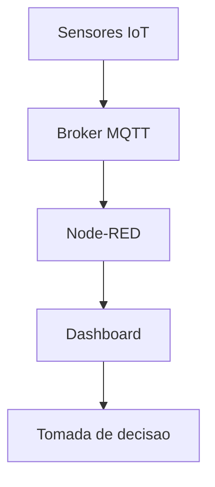

# Trabalho Final - Industria 4.0

Projeto academico do componente **Industria 4.0**, desenvolvido para demonstrar uma solucao de **manutencao preditiva** usando MQTT, Node-RED e dashboard em tempo real.

## Cenario escolhido

**Cenario 1 - Manutencao Preditiva**

O projeto monitora motores eletricos das linhas de producao. A ideia e identificar sinais de desgaste antes da falha, analisando principalmente **temperatura** e **vibracao**.

## Arquitetura



## Broker MQTT

- Broker: `76.13.175.168`
- Porta: `1883`
- Topico usado: `sensores/#`

## Regras de alerta

- **Temperatura acima de 35 graus Celsius**: risco de aquecimento.
- **Vibracao acima de 4 g**: risco de desgaste mecanico.

Quando uma dessas condicoes ocorre, o dashboard exibe um alerta de manutencao preditiva.

## Dashboard

O dashboard atende aos requisitos do trabalho:

- 6 indicadores em tempo real:
  - Temperatura
  - Umidade
  - Radiacao Solar
  - Pressao
  - Vazao
  - Vibracao
- 3 graficos historicos:
  - Temperatura por linha
  - Vibracao por linha
  - Vazao por linha
- 1 alerta visual:
  - Alerta de manutencao quando temperatura ou vibracao ultrapassa o limite.

## Como executar no Node-RED

1. Instale o Node.js.
2. Instale o Node-RED:

```bash
npm install -g --unsafe-perm node-red
```

3. Inicie o Node-RED:

```bash
node-red
```

4. Acesse no navegador:

```text
http://localhost:1880
```

5. Instale o dashboard:

```text
Menu -> Manage palette -> Install -> node-red-dashboard
```

6. Importe o fluxo:

```text
node-red/fluxo-manutencao-preditiva.json
```

7. Clique em `Deploy`.
8. Abra o dashboard:

```text
http://localhost:1880/ui
```

## Teste MQTT pelo terminal

Com o Mosquitto Client instalado:

```powershell
mosquitto_sub -h 76.13.175.168 -t "sensores/#" -v
```

Exemplo de mensagem recebida:

```json
{
  "temperatura": 29.2,
  "umidade": 67.1,
  "radiacao": 349.9,
  "pressao": 4.9,
  "vazao": 69.2,
  "acelerometro": 3.07
}
```

## Estrutura do repositorio

```text
.
|-- README.md
|-- node-red/
|   `-- fluxo-manutencao-preditiva.json
`-- docs/
    |-- analise-manutencao-preditiva.md
    |-- roteiro-pitch.md
    |-- TrabalhoFinalInd_Ostria40.pdf
    `-- TrabalhoFinalInd_Ostria40.extracted.txt
```

## Materiais de apresentacao

- [Analise do projeto](docs/analise-manutencao-preditiva.md)
- [Roteiro do pitch](docs/roteiro-pitch.md)
- [Enunciado original](docs/TrabalhoFinalInd_Ostria40.pdf)

## Beneficio esperado

A solucao permite agir antes da falha do motor, reduzindo paradas inesperadas, manutencao emergencial, perda de producao e custos operacionais.
