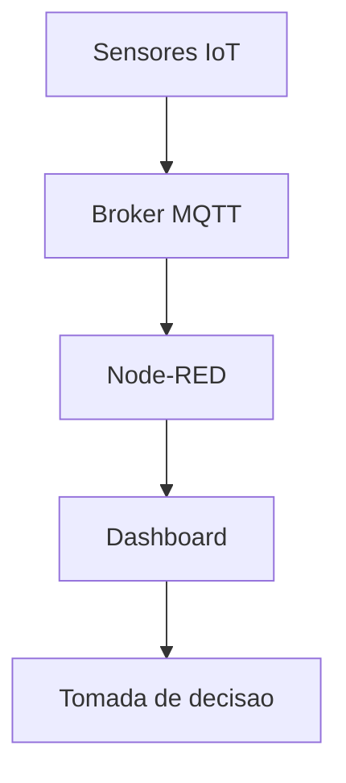

# Trabalho Final - Industria 4.0

Projeto academico do componente **Industria 4.0**, desenvolvido para demonstrar uma solucao de **manutencao preditiva** usando MQTT, Node-RED e dashboard em tempo real.

## Integrantes

- Alexandre Rezende Silva - RA 5127545
- Raul Fernandes Silva Melo - RA 5170007
- Bruna Duarte Bueno - RA 5161875
- Matheus Lemes Carneiro - RA 5161892
- Luciano Roberto Monteiro Araújo - RA 5160512

## Cenario escolhido

**Cenario 1 - Manutencao Preditiva**

O projeto monitora motores eletricos das linhas de producao. A ideia e identificar sinais de desgaste antes da falha, analisando principalmente **temperatura** e **vibracao**.

> Observacao sobre os dados: o broker da disciplina disponibiliza um fluxo de sensores genericos de ambiente. Adotamos esse fluxo como fonte de dados e definimos limiares de demonstracao para representar a condicao de um motor. A logica de processamento, alerta e visualizacao e a mesma que seria usada em sensores reais de motor.

## Arquitetura



## Broker MQTT

- Broker: `76.13.175.168`
- Porta: `1883`
- Topico usado: `sensores/#`
- Linhas monitoradas: `sensores/linha1` a `sensores/linha5`

## Regras de alerta

- **Temperatura acima de 35 graus Celsius**: risco de aquecimento.
- **Vibracao acima de 4 g**: risco de desgaste mecanico.

A avaliacao e feita **por linha**: o alerta dispara se qualquer uma das linhas ultrapassar um dos limites, e a mensagem indica qual linha e por que motivo.

## Dashboard

O dashboard atende aos requisitos do trabalho:

- 6 indicadores em tempo real:
  - Temperatura (pior caso entre as linhas - valor maximo)
  - Umidade (media das linhas)
  - Radiacao Solar (media das linhas)
  - Pressao (media das linhas)
  - Vazao (media das linhas)
  - Vibracao (pior caso entre as linhas - valor maximo)
- 3 graficos historicos (uma curva por linha):
  - Temperatura por linha
  - Vibracao por linha
  - Vazao por linha
- 1 alerta visual:
  - Alerta de manutencao quando temperatura ou vibracao de qualquer linha ultrapassa o limite.

### Por que maximo em uns e media em outros

Com cinco linhas publicando ao mesmo tempo, um unico gauge nao consegue mostrar todas. A escolha foi:

- **Temperatura e Vibracao** mostram o **maximo** entre as linhas, porque sao os indicadores que disparam manutencao. Assim o ponteiro do gauge sempre concorda com o texto de alerta (se o alerta aponta a linha5 a 36 graus, o gauge tambem marca 36).
- **Umidade, Radiacao, Pressao e Vazao** mostram a **media** das linhas, como valor representativo do conjunto, ja que nao acionam alerta.

O detalhe por linha continua disponivel nos tres graficos historicos, onde cada linha aparece como uma curva separada.

### Robustez

Cada sensor e lido de forma independente. Se uma mensagem chegar sem algum campo, os demais sensores daquela linha continuam sendo processados e o ultimo valor valido e mantido, em vez de descartar a leitura inteira.

## Como executar no Node-RED

1. Instale o Node.js.
2. Instale o Node-RED:

```bash
npm install -g --unsafe-perm node-red
```

3. Inicie o Node-RED:

```bash
node-red
```

4. Acesse no navegador:

```text
http://localhost:1880
```

5. Instale o dashboard:

```text
Menu -> Manage palette -> Install -> node-red-dashboard
```

6. Importe o fluxo:

```text
node-red/fluxo-manutencao-preditiva.json
```

7. Clique em `Deploy`.
8. Abra o dashboard:

```text
http://localhost:1880/ui
```

## Teste MQTT pelo terminal

Com o Mosquitto Client instalado:

```powershell
mosquitto_sub -h 76.13.175.168 -t "sensores/#" -v
```

Exemplo de mensagem recebida:

```json
{
  "temperatura": 29.2,
  "umidade": 67.1,
  "radiacao": 349.9,
  "pressao": 4.9,
  "vazao": 69.2,
  "acelerometro": 3.07
}
```

## Estrutura do repositorio

```text
.
|-- README.md
|-- node-red/
|   `-- fluxo-manutencao-preditiva.json
`-- docs/
    |-- analise-manutencao-preditiva.md
    |-- roteiro-pitch.md
    `-- TrabalhoFinalInd_Ostria40.pdf
```

## Materiais de apresentacao

- [Analise do projeto](docs/analise-manutencao-preditiva.md)
- [Roteiro do pitch](docs/roteiro-pitch.md)
- [Enunciado original](docs/TrabalhoFinalInd_Ostria40.pdf)

## Beneficio esperado

A solucao permite agir antes da falha do motor, reduzindo paradas inesperadas, manutencao emergencial, perda de producao e custos operacionais.
