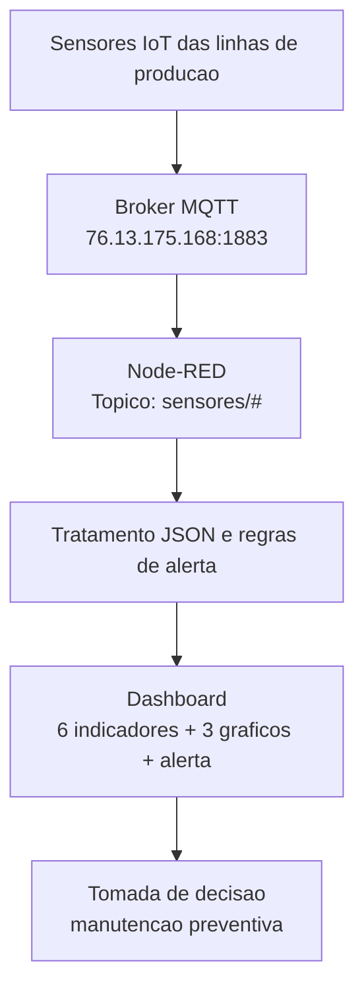

# Trabalho Final - Cenario 1: Manutencao Preditiva

## Integrantes

- Alexandre Rezende Silva - RA 5127545
- Raul Fernandes Silva Melo - RA 5170007
- Bruna Duarte Bueno - RA 5161875
- Matheus Lemes Carneiro - RA 5161892
- Luciano Roberto Monteiro Araújo - RA 5160512

## Problema escolhido

Uma fabrica possui motores eletricos nas linhas de producao. Com o tempo, esses motores podem apresentar desgaste mecanico, desalinhamento, aquecimento ou falha em rolamentos. Esses problemas costumam aparecer primeiro como aumento de vibracao e aumento de temperatura.

A solucao proposta monitora os sensores MQTT em tempo real para identificar sinais de falha antes que o equipamento pare a producao.

> Sobre a fonte de dados: o broker da disciplina fornece um fluxo de sensores genericos de ambiente, publicado em cinco linhas (`sensores/linha1` a `sensores/linha5`). Usamos esse fluxo como entrada e definimos limiares de demonstracao para representar a condicao de um motor. A logica aplicada e a mesma que seria usada com sensores dedicados de motor.

## Arquitetura



## Regras de manutencao preditiva

- Temperatura normal: ate 35 graus Celsius.
- Temperatura em alerta: acima de 35 graus Celsius.
- Vibracao normal: ate 4 g.
- Vibracao em alerta: acima de 4 g.
- A avaliacao e feita por linha. Se a temperatura ou a vibracao de qualquer linha ultrapassar o limite, o dashboard mostra alerta de manutencao indicando a linha e o motivo.

## Indicadores do dashboard

Como cinco linhas publicam ao mesmo tempo, cada indicador agrega os valores das linhas de uma forma escolhida conforme a funcao do indicador:

- Temperatura em graus Celsius - **maximo entre as linhas** (pior caso de risco).
- Vibracao em g - **maximo entre as linhas** (pior caso de risco).
- Umidade em porcentagem - **media das linhas**.
- Radiacao solar em W/m2 - **media das linhas**.
- Pressao em bar - **media das linhas**.
- Vazao em L/min - **media das linhas**.

O criterio: temperatura e vibracao usam o maximo porque sao os indicadores que acionam manutencao, garantindo que o gauge concorde sempre com o texto de alerta. Os demais usam a media como valor representativo do parque de linhas.

## Graficos historicos

Cada grafico apresenta uma curva por linha, identificada pelo nome da linha na legenda:

- Historico de temperatura por linha.
- Historico de vibracao por linha.
- Historico de vazao por linha.

## Tratamento e robustez dos dados

O fluxo Node-RED recebe cada mensagem MQTT, converte o JSON e processa cada sensor de forma independente. Se algum campo vier ausente ou invalido, os demais sensores daquela linha continuam sendo processados e o ultimo valor valido e mantido, evitando que uma leitura parcial descarte a mensagem inteira. O alerta visual e o popup de notificacao sao disparados na transicao de normal para alerta, evitando repeticao a cada mensagem.

## Como importar o fluxo no Node-RED

1. Instale o Node.js.
2. Instale o Node-RED:

```bash
npm install -g --unsafe-perm node-red
```

3. Execute:

```bash
node-red
```

4. Acesse:

```text
http://localhost:1880
```

5. Instale o dashboard:

```text
Menu -> Manage palette -> Install -> node-red-dashboard
```

6. Importe o arquivo:

```text
node-red/fluxo-manutencao-preditiva.json
```

7. Clique em `Deploy`.
8. Abra o dashboard:

```text
http://localhost:1880/ui
```

## Analise esperada dos dados

O dashboard permite acompanhar se os motores estao operando dentro de uma faixa segura. Quando a temperatura sobe acima de 35 graus Celsius, pode existir sobrecarga, atrito, falha de refrigeracao ou operacao fora da condicao ideal. Quando a vibracao passa de 4 g, pode existir desalinhamento, desgaste, folga mecanica ou problema em rolamentos.

Como os indicadores de risco mostram o pior caso entre as linhas, qualquer linha que entre em condicao critica e refletida imediatamente no gauge e no alerta, enquanto os graficos por linha permitem identificar exatamente qual motor esta se afastando do comportamento normal.

Com essas informacoes, a empresa pode agir antes da falha total, programando uma manutencao preventiva. Isso reduz paradas inesperadas, evita perda de producao, aumenta a vida util dos equipamentos e melhora a seguranca operacional.

## Beneficio economico

A principal economia vem da reducao de parada nao planejada. Em vez de esperar o motor quebrar e interromper a linha de producao, a empresa recebe um alerta antecipado e pode planejar a manutencao em um horario de menor impacto. Isso reduz custo de emergencia, desperdicio de materia-prima, horas extras e perda de produtividade.
